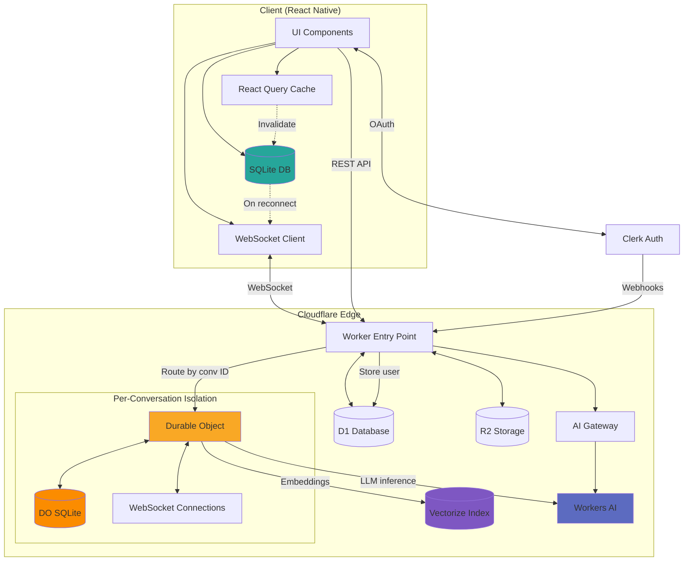
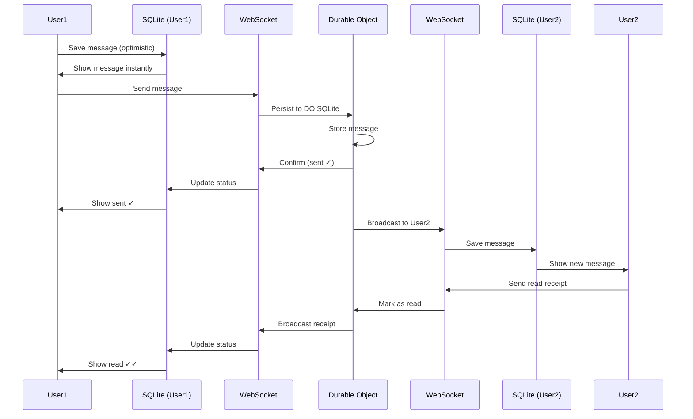

# MessageAI

**Real-time messaging on the edge, enhanced with RAG and multi-step AI agents.**

Built in 7 days to showcase modern edge computing + AI integration. React Native frontend, 100% Cloudflare backend (Workers + Durable Objects + Workers AI + Vectorize).

## 🎯 What Makes This Interesting

1. **Performance Discovery:** Backend so fast it overwhelmed the frontend - had to add deduplication because Cloudflare Workers delivered 100 messages faster than React Native could save them locally.

2. **Context-Aware Agent:** Multi-step event planner that reads your conversation, understands what you're planning, and adapts its workflow (simple meetings skip venue steps, team lunches get full preference analysis).

3. **Edge-Native AI:** RAG + semantic search + LLM all on Cloudflare. No OpenAI, no external vector DB. Sub-100ms latency.

4. **Production Patterns:** WebSocket hibernation, optimistic UI, local-first sync, offline queue - built with real-world reliability patterns, not toy demo shortcuts.

## 🚀 Quick Start

```bash
npm install
cd worker && npm install && cd ..

# Configure (see SETUP-QUICK.md)
# - Edit lib/config.ts (Clerk key, worker URL)
# - Edit worker/wrangler.jsonc (D1 database ID)
# - Run D1 migrations

# Run on different platforms
npm start              # Mobile (iOS/Android via Expo Go)
npm run web            # Web (localhost:8081)
cd worker && npm run deploy  # Backend (Cloudflare)
```

**Multi-Platform Support:**
- ✅ **iOS** - Physical devices (7-day certificate) or TestFlight
- ✅ **Android** - APK or Google Play
- ✅ **Web** - Chrome, Firefox, Safari (desktop & mobile)

**Web deployment:** `npm run web:deploy` (serves static assets from Worker)

## 🤖 AI Features for Remote Teams

**5 Core Features:**
- **Thread Summarization** - 3-bullet summaries of long conversations (structured JSON output, temp 0.3)
- **Action Item Extraction** - Auto-detects tasks with assignees & due dates from chat history
- **Priority Detection** - Flags urgent/important messages (HIGH/MEDIUM badges with reasons)
- **Decision Tracking** - Extracts consensus points ("we decided...", "let's go with...")
- **Smart Search** - Semantic search with relevance scores (reuses RAG embeddings)

**Advanced: Multi-Step Event Planner Agent**
- Reads conversation context to understand event type
- Extracts team availability and preferences from chat history
- Generates venue suggestions for food events (or skips for meetings)
- Adaptive workflow: 2-6 steps depending on event complexity
- State persistence across multiple turns

**RAG Pipeline:**
- Sequential embedding (5 msgs/batch, 300ms delay) - avoids rate limits
- Vectorize storage (bge-base-en-v1.5, 768D, cosine similarity)
- Proactive embedding on panel open (background, non-blocking)
- Hybrid context: top-5 semantic search + last 10 messages
- Qwen 1.5 14B via Workers AI (faster than Llama 8B)

All AI runs on Cloudflare Workers AI + Vectorize - no external services, sub-100ms latency.

## 🏗️ Architecture

### System Flow



### Message Flow (Real-Time)



### AI Pipeline (RAG)

```mermaid
graph LR
    subgraph "User Action"
        Q[User asks question]
    end
    
    subgraph "Preparation"
        Q --> Fetch[Fetch messages]
        Fetch --> Batch[Batch into groups of 5]
        Batch --> Embed[Generate embeddings]
        Embed -->|300ms delay| Vec[Store in Vectorize]
    end
    
    subgraph "Query"
        Vec --> Search[Semantic search top-5]
        Fetch --> Recent[Get last 10 messages]
        Search --> Merge[Merge context]
        Recent --> Merge
        Merge --> Prompt[Build prompt]
    end
    
    subgraph "Response"
        Prompt --> LLM[Workers AI<br/>Qwen 1.5 14B]
        LLM --> Gateway[AI Gateway<br/>Metadata tracking]
        Gateway --> StreamResponse[Stream response]
        StreamResponse --> Save[Save as message]
        Save --> Broadcast[Broadcast to users]
    end
```



**Key Patterns:**
- **Per-conversation isolation:** Each chat = one DO = independent scaling
- **Hibernating WebSockets:** Connections survive between messages (low memory)
- **Local-first sync:** SQLite is UI source of truth, DO is persistence layer
- **Edge-native AI:** Everything runs on Cloudflare, no external API calls

## 📂 Project Structure

```
messageAI/
├── app/                          # Expo Router screens
│   ├── _layout.tsx              # Root with providers
│   ├── index.tsx                # Auth redirect
│   ├── auth/                    # Auth screens
│   │   ├── sign-in.tsx
│   │   └── sign-up.tsx
│   └── (app)/                   # Protected app routes
│       ├── _layout.tsx
│       └── index.tsx            # Conversation list
├── lib/                         # Frontend libraries
│   ├── api/                     # API client & types
│   ├── db/                      # SQLite schema & queries
│   └── stores/                  # Zustand stores
├── worker/                      # Cloudflare Worker
│   └── src/
│       ├── index.ts             # Main entry point
│       ├── durable-objects/     # Durable Object classes
│       ├── db/                  # D1 schema & migrations
│       ├── handlers/            # Webhook handlers
│       └── types/               # Backend types
├── shared/                      # Shared types
│   └── types.ts                 # Client-server types
└── tasks/                       # Task tracking
    └── tasks-prd-messageai.md
```

## 🛠️ Tech Stack

**Frontend:** React Native (Expo SDK 54) · React Native Web · React Query v5 · Zustand v5 · Expo SQLite · Clerk · TypeScript 5.9

**Backend:** Cloudflare Workers · Durable Objects · D1 · R2 · Workers AI · Vectorize · AI Gateway · TypeScript 5.9

**AI Models:** Qwen 1.5 14B (chat responses) · Llama 3.1 8B Fast (agent workflow) · bge-base-en-v1.5 (embeddings)

**Platforms:** iOS · Android · Web (desktop & mobile browsers)

## 📚 Documentation

- **[SETUP-QUICK.md](./SETUP-QUICK.md)** - Setup guide (~15 min to deploy)
- **[DEMO-ANGLES.md](./DEMO-ANGLES.md)** - Demo talking points
- **[memory-bank/](./memory-bank/)** - Architecture, patterns, learnings

## 💡 Development Highlights

**Hard Problems Solved:**
- WebSocket hibernation with session restoration (serializeAttachment pattern)
- Network monitor race condition (reconnection coordination)
- Duplicate messages at high speed (render-level deduplication)
- Sequential embedding to avoid rate limits (smart batching)
- Agent state persistence across workflow steps

**Performance Discovery:**
Backend delivered 100 messages faster than React Native could process them locally - had to add:
- FOREIGN KEY guards for read receipts
- useMemo deduplication at render time
- Inverted FlatList pattern (standard for chat apps)

**Development Velocity:**
Built in 7 days using AI-assisted development:
- MVP (11 features) in 24 hours
- 5 AI features + RAG in 3 days
- Multi-step agent in 2 days
- Testing & production hardening in 2 days

## 🧪 Testing

**Debug Tools:**
- Tap chat title 3x → debug panel
- Shows: WebSocket status, message count, online users
- Test buttons: 20 rapid messages, 100 performance test, clear DB

**Validated Scenarios:**
✅ Real-time chat (2+ devices)
✅ Offline → online sync
✅ Force-quit persistence
✅ Group chat (3+ participants)
✅ Rapid messaging (100+ messages)
✅ Network recovery (airplane mode)
✅ AI features with large conversations

## 🎓 Key Learnings

1. **Expo Go + localhost ≠ works** - Phone can't reach your laptop. Deploy early or use ngrok.
2. **React version must match RN renderer** - Lock at 19.1.0, use package.json overrides.
3. **DO storage persists independently** - Same conversation ID = same DO = old messages appear.
4. **Inverted FlatList is standard** - Reverse data array, set inverted={true}, zero scroll animation.
5. **Sequential embedding >> parallel** - 5 msgs/batch with 300ms delay prevents rate limits elegantly.
6. **Per-conversation WebSockets = standard** - Each chat has own connection, use push for background.

Full learnings documented in [memory-bank/activeContext.md](./memory-bank/activeContext.md)

---

**Live Demo:** https://message.adamwhite.work  
**Built:** October 2025  
**Timeline:** 7 days (MVP in 24 hours)  
**Stack:** React Native + Cloudflare Workers + Durable Objects + Workers AI + Vectorize
